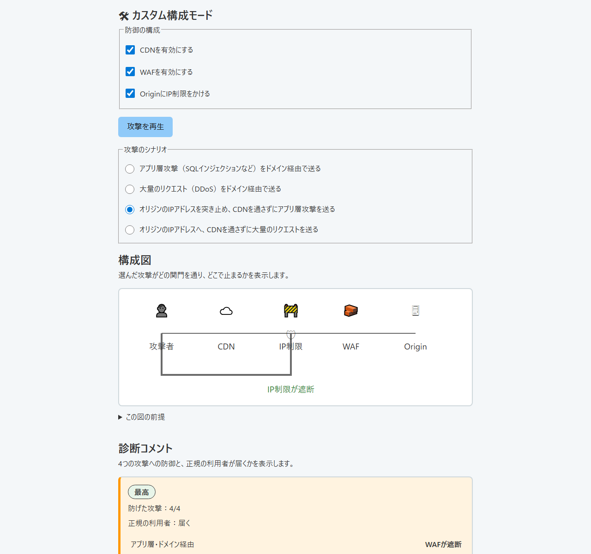
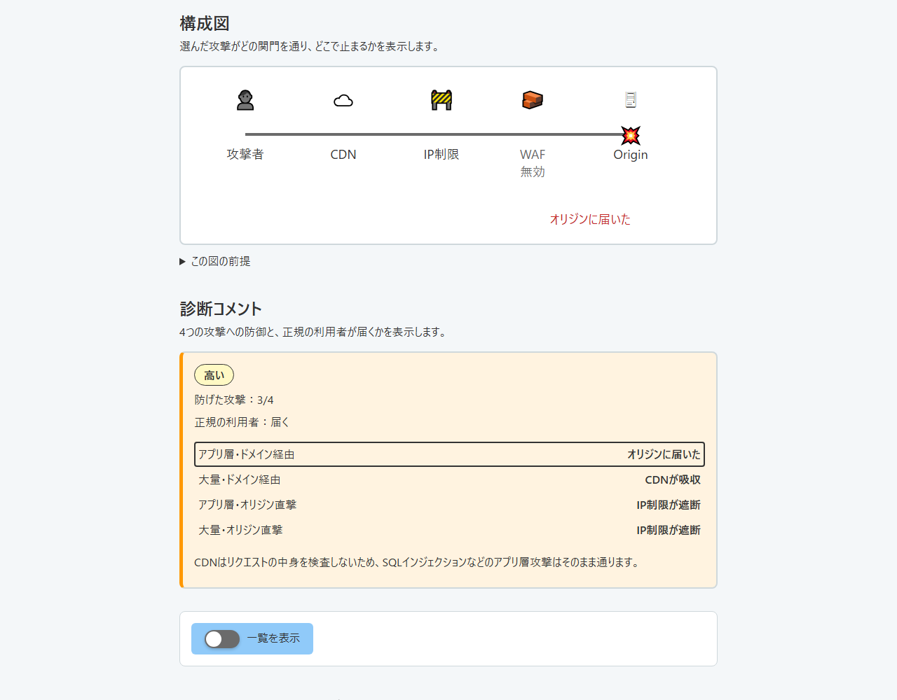
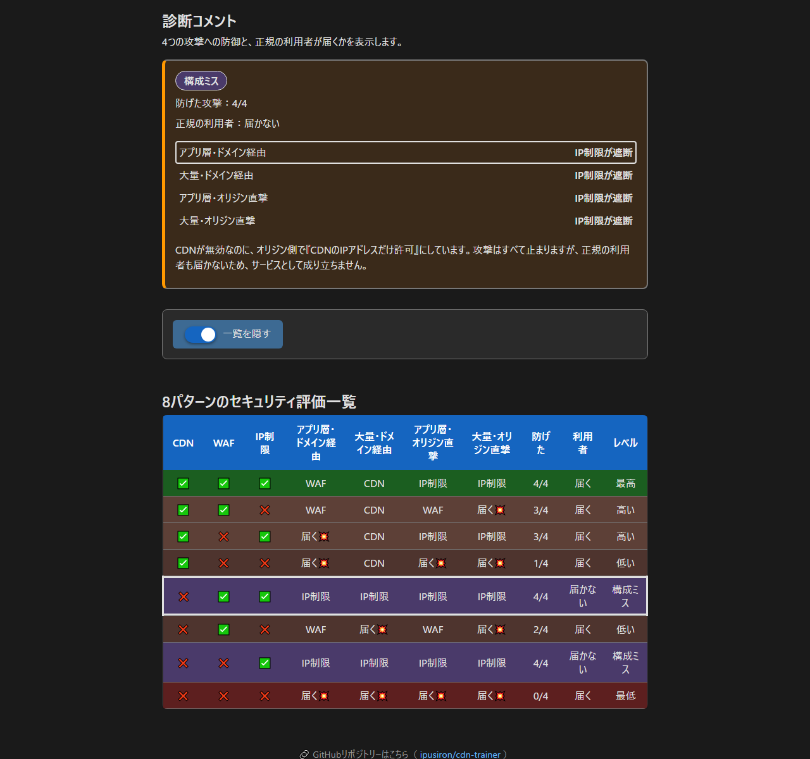

English · [日本語](README.md)

# CDN Trainer - Interactive tool for learning secure CDN configurations


[](https://ipusiron.github.io/cdn-trainer/)

**Day026 - 100 Security Tools with Generative AI**

**CDN Trainer** is an educational web tool for judging CDN, WAF and origin server configurations by
choosing them yourself. It compares four attack scenarios across eight configurations and shows, in a
diagram and a diagnosis, where each attack stops and whether legitimate users still reach the origin.

---

## 🌐 Demo

👉 [https://ipusiron.github.io/cdn-trainer/?lang=en](https://ipusiron.github.io/cdn-trainer/?lang=en)

It runs directly in the browser.

---

## 📸 Screenshots



> *CDN, WAF and IP restriction all enabled. An application-layer attack that bypasses the CDN stops at the IP restriction, and the verdict is Best, 4/4.*



> *Only the CDN and the IP restriction are enabled. An application-layer attack through the domain reaches the origin, and the verdict is High, 3/4.*



> *Enabling the IP restriction without a CDN shuts legitimate users out too. The dark-mode diagnosis and the table of eight configurations show the misconfiguration.*

The screenshots show the Japanese interface; the same screens are available in English.

---

## ✨ Features

- Eight configurations combining an enabled or disabled CDN, WAF and IP restriction
- Four scenarios combining an application-layer attack or a flood with the domain route or the direct route
- An SVG animation of the attack route and the point where it stops
- A diagnosis giving the number of attacks blocked, legitimate-user access and one of five levels
- A table of all eight configurations, with the current one highlighted
- Dark mode with a saved preference, and help that explains the assumptions and the controls
- A Japanese and English interface (`?lang=ja` / `?lang=en`, and the choice is saved)
- Keyboard operation, reduced-motion support and a layout that works on a phone

---

## 📖 How to use it

1. Choose the CDN, WAF and IP restriction under "Defenses".
2. Choose the kind of attack and its route under "Attack scenario".
3. Read the diagram and the diagnosis, which update on their own, for the stopping point and legitimate-user access.
4. Press "Replay the attack" to watch the same state again.
5. Press "Show the table" to compare the eight configurations. On a narrow screen, scroll the diagram and the table sideways.
6. Use the help button for the assumptions and the level criteria. Escape closes it.
7. Use the "EN" button in the header to switch language. The configuration, the scenario and the open table are kept.

Start with everything enabled and choose the application-layer attack straight to the origin: it stops at the IP restriction.
Then disable the WAF alone and switch to the application-layer attack through the domain: it passes the CDN and the IP restriction and reaches the origin.

---

## 🔬 The model behind the verdict

### Assumptions

- Traffic through the domain travels attacker to CDN (when enabled) to the origin entrance (IP restriction) to the WAF to the origin.
- Traffic straight to the origin (a CDN bypass) travels attacker to the origin entrance (IP restriction) to the WAF to the origin, never touching the CDN.
- The WAF sits immediately in front of the origin, for example on a load balancer.
- The IP restriction at the origin entrance admits connections from the CDN IP addresses only.
- The CDN absorbs floods of requests but does not inspect the contents of application-layer attacks. The WAF stops application-layer attacks but does not absorb floods of requests.
- When the CDN is disabled, the domain points straight at the origin.

### The four scenarios

- App layer, via domain: send an application-layer attack, such as SQL injection, through the domain.
- Flood, via domain: send a flood of requests (DDoS) through the domain.
- App layer, straight to origin: find the origin IP address and send an application-layer attack to it, bypassing the CDN.
- Flood, straight to origin: send a flood of requests to the origin IP address, bypassing the CDN.

### How the levels are decided

- Misconfig: legitimate users cannot reach the origin. This outweighs the number blocked.
- Best: all four attacks are blocked and legitimate users reach the origin.
- High: three attacks are blocked and legitimate users reach the origin.
- Low: one or two attacks are blocked and legitimate users reach the origin.
- Worst: not one attack is blocked.

### The eight configurations

✅ means enabled and ❌ means disabled. The attack columns name the gate that stopped the attack, or say "Reaches💥" when nothing stopped it.

| CDN | WAF | IP limit | App layer, via domain | Flood, via domain | App layer, straight to origin | Flood, straight to origin | Blocked | Users | Level |
|---|---|---|---|---|---|---|---|---|---|
| ✅ | ✅ | ✅ | WAF | CDN | IP | IP | 4/4 | Reach | Best |
| ✅ | ✅ | ❌ | WAF | CDN | WAF | Reaches💥 | 3/4 | Reach | High |
| ✅ | ❌ | ✅ | Reaches💥 | CDN | IP | IP | 3/4 | Reach | High |
| ✅ | ❌ | ❌ | Reaches💥 | CDN | Reaches💥 | Reaches💥 | 1/4 | Reach | Low |
| ❌ | ✅ | ✅ | IP | IP | IP | IP | 4/4 | Blocked | Misconfig |
| ❌ | ✅ | ❌ | WAF | Reaches💥 | WAF | Reaches💥 | 2/4 | Reach | Low |
| ❌ | ❌ | ✅ | IP | IP | IP | IP | 4/4 | Blocked | Misconfig |
| ❌ | ❌ | ❌ | Reaches💥 | Reaches💥 | Reaches💥 | Reaches💥 | 0/4 | Reach | Worst |

### Why the number of enabled options is not the score

Two configurations can enable the same number of options and still stop different attacks.
A configuration that stops every attack is unusable as a service if legitimate users cannot reach it, so the attack results and legitimate-user access are judged separately.

---

## 🎯 Learning points

### Defense in depth and application-layer defense

In this model the CDN, the WAF and the IP restriction have different jobs.
Because a CDN on its own lets application-layer attacks through, the tool shows why a WAF belongs alongside it.

### CDN bypass and the origin IP address

Enabling a CDN does not help once the origin IP address is known, because the CDN can be bypassed.
Hiding the address is not enough: the connections the origin accepts have to be restricted as well.

Origin addresses leak through DNS-only records, mail served from the same host and historical DNS records.
DNS information that has already been published does not disappear when a CDN is enabled later.
The source is [Cloudflare's guide to protecting your origin server](https://developers.cloudflare.com/fundamentals/security/protect-your-origin-server/).

### An IP restriction without a CDN is a misconfiguration

When only the CDN is allowed to connect and the CDN is then disabled, legitimate users are shut out too.
"Attacks blocked: 4/4" on its own is not a sign of safety; the route legitimate users take has to be checked as well.

---

## 🎯 Use cases

### Ways of using this tool in particular

- Confirming the attack that bypasses the CDN and hits the origin IP directly (defense-in-depth and CDN classes): with CDN, WAF and IP limit all on, a flood through the domain is stopped at the CDN. But an attack that hits the origin IP directly is stopped only by the IP limit (allowing only the CDN's IPs). Turn the IP limit off and this direct attack reaches the origin. You can confirm that a CDN protects only traffic that goes through it, so the origin must be restricted to the CDN's IPs
- Confirming that the layer that stops an attack differs by attack (detection-design classes): running the four attacks with everything on, the stopping layer splits, an application-layer attack through the domain is stopped by the WAF, a flood through the domain by the CDN, and the direct attacks by the IP limit. You can confirm the idea of defense in depth, where each layer catches a different attack rather than one layer stopping everything
- Confirming that attacks are stopped while legitimate traffic passes (availability classes): with everything on, all four attacks are stopped while legitimate user traffic reaches the origin. You can confirm that a defense must not only stop attacks but also not block legitimate users at the same time

### General uses

- Learn the roles of a CDN, a WAF and an IP limit, and which layer stops which attack, in class or training
- Use it as a prompt to check whether your origin IP is restricted to traffic through the CDN
- Use it as material to explain defense in depth against DDoS and application-layer attacks

## 🔒 What to do in production

In production, consider authenticating the source of the connection in addition to an IP restriction, or a connection method that does not expose the origin at all.

- Allow the CDN IP addresses at the origin and refuse everything else.
- Have the CDN add a secret HTTP header and verify it at the origin.
- Use Authenticated Origin Pulls so that a certificate proves the connection came from Cloudflare.
- Use Cloudflare Tunnel so that the origin needs no public IP address.

These methods and their conditions are described in [Cloudflare's guide to protecting your origin server](https://developers.cloudflare.com/fundamentals/security/protect-your-origin-server/).
Note also that a shared certificate or IP range alone does not prove that a request came from your own service.

With CloudFront, the AWS-managed prefix list `com.amazonaws.global.cloudfront.origin-facing` lets a security group allow the IP ranges of origin-facing servers.
See [the AWS description of IP address ranges](https://docs.aws.amazon.com/AmazonCloudFront/latest/DeveloperGuide/LocationsOfEdgeServers.html) for details.

CloudFront can also send a secret header to an ALB, with the ALB forwarding only the requests that carry the value.
Keep the header name and value secret, and use HTTPS.
VPC origins allow a connection to an ALB in a private subnet without exposing it to the public internet.
See [restricting access to load balancers on AWS](https://docs.aws.amazon.com/AmazonCloudFront/latest/DeveloperGuide/restrict-access-to-load-balancer.html) for details.

---

## 🔒 Security of this tool

- A meta CSP allows same-origin scripts and styles only. No inline handlers and no style attributes.
- The referrer policy is set to `no-referrer`.
- The interface is built with DOM APIs and `textContent`. `innerHTML` is never used.
- While running, the app contacts no external API, CDN or font service.
- The only things stored in localStorage are the dark-mode preference and the language choice. The app works when storage is unavailable.

---

## ⚠️ Caveats

This model is simplified for teaching. Real CDNs also offer rate limiting and WAF features, and what they can block depends on the product, the contract and the settings.
The placement of the WAF changes both the route and the outcome; this version fixes it immediately in front of the origin.
Choosing the placement is planned for a second release.

An IP restriction is not always sufficient. "Best" in this tool is a verdict inside the model, not a guarantee about a real system.

---

## 🧾 Glossary

| Term | Description |
|------|------|
| **CDN (Content Delivery Network)** | Relay servers around the world that deliver content. In this model, the layer that absorbs floods of requests. |
| **WAF (Web Application Firewall)** | A mechanism that detects and blocks attacks on a web application, such as SQL injection. |
| **Origin server** | The server that holds the original content or application. The thing being protected. |
| **IP restriction** | Admitting connections from particular IP addresses only. In this model, the CDN addresses alone. |
| **CDN bypass** | Connecting to the origin server directly, without going through the CDN. |
| **Configuration diagram** | A drawing of the flow of traffic and the position of each defense. |

---

## 🔗 References

- [Cloudflare: Protect your origin server](https://developers.cloudflare.com/fundamentals/security/protect-your-origin-server/)
- [AWS: Locations and IP address ranges of CloudFront edge servers](https://docs.aws.amazon.com/AmazonCloudFront/latest/DeveloperGuide/LocationsOfEdgeServers.html)
- [AWS: Restrict access to Application Load Balancers](https://docs.aws.amazon.com/AmazonCloudFront/latest/DeveloperGuide/restrict-access-to-load-balancer.html)

---

## 🧪 Tests

Run the following command with Node.js 22 or later. No extra packages and no install step are needed.
GitHub Actions runs them automatically on push and on pull requests.

```sh
npm test
```

| Test file | What it checks |
|---|---|
| `test/model.test.js` | Results, routes and coordinates for eight configurations by four scenarios, invalid input and model properties |
| `test/messages.test.js` | Dictionary keys and interpolation, and the absence of Japanese literals in the model and the interface code |
| `test/i18n.test.js` | Matching Japanese and English dictionaries, every key the page and the code ask for, language selection and storage, and switching without losing state |
| `test/html.test.js` | CSP, referrer, ARIA, scenarios and the absence of inline code |
| `test/script.test.js` | DOM APIs, cancellation of requestAnimationFrame and localStorage exception handling |
| `test/contrast.test.js` | A contrast ratio of at least 4.5:1 for every color pair in both themes |
| `test/format.test.js` | Longest line and line count in sources and tests, to detect minification |
| `test/readme.test.js` | Every cell of the eight-configuration table, the YAML structure, the tree and the image references |

---

## 📁 Directory structure

```text
cdn-trainer/                 # Static web app for learning CDN configurations
├── .github/                 # GitHub settings
│   └── workflows/           # CI workflows
│       └── test.yml         # Runs the Node.js 22 tests on push and pull request
├── .gitignore               # Excludes node_modules, logs and .claude/ from Git
├── .nojekyll                # Marker that disables Jekyll processing on GitHub Pages
├── CLAUDE.md                # Development guide (layout, commands, model, tests)
├── LICENSE                  # MIT license
├── README.md                # Japanese README (usage, model, tests, layout)
├── README.en.md             # This file
├── package.json             # Defines npm test. No dependencies
├── index.html               # Screen, configuration, scenarios, help and meta CSP
├── style.css                # Color variables, dark mode, responsive rules, diagram
├── cdn-messages.js          # Japanese and English dictionary of interface text
├── i18n.js                  # Language selection, storage and data-i18n. Holds no dictionary
├── cdn-model.js             # Verdict, route and coordinates for 4 scenarios by 8 configurations
├── script.js                # Diagram drawing and replay, diagnosis, table, help and theme
├── assets/                  # Images for the README
│   ├── screenshot.png       # All enabled; a direct attack blocked by the IP restriction
│   ├── screenshot2.png      # CDN and IP restriction only; an application attack gets through
│   └── screenshot3.png      # Dark mode; the misconfiguration verdict and the table
└── test/                    # Automated tests run by node --test
    ├── model.test.js        # Expected verdicts, routes, coordinates and properties
    ├── messages.test.js     # Dictionary keys and Japanese literals in JS
    ├── i18n.test.js         # Matching dictionaries, key coverage, language selection and storage
    ├── html.test.js         # CSP, referrer, ARIA and the absence of style attributes
    ├── script.test.js       # DOM APIs, rAF cancellation and storage exception handling
    ├── contrast.test.js     # Contrast ratios in light and dark mode
    ├── format.test.js       # Longest line and line count, to detect minification
    └── readme.test.js       # README tables, YAML, tree and image references
```

---

## 💻 Requirements

Static HTML, CSS and JavaScript for a modern browser. No external library and no build step.
Both HTTP delivery and `file://` have been verified in Chromium.

Open `index.html` directly, or run the following command in the repository folder and open `http://localhost:8000/`.

```sh
python -m http.server 8000
```

---

## 📄 License

MIT License - see [LICENSE](LICENSE) for details.

---

## 🛠️ About this tool

This tool was built as part of the "100 Security Tools with Generative AI" project,
which produces and publishes security-related tools over 100 days with the help of AI.

For the project and the other tools, see the page below.

🔗 [https://akademeia.info/?page_id=42163](https://akademeia.info/?page_id=42163)
