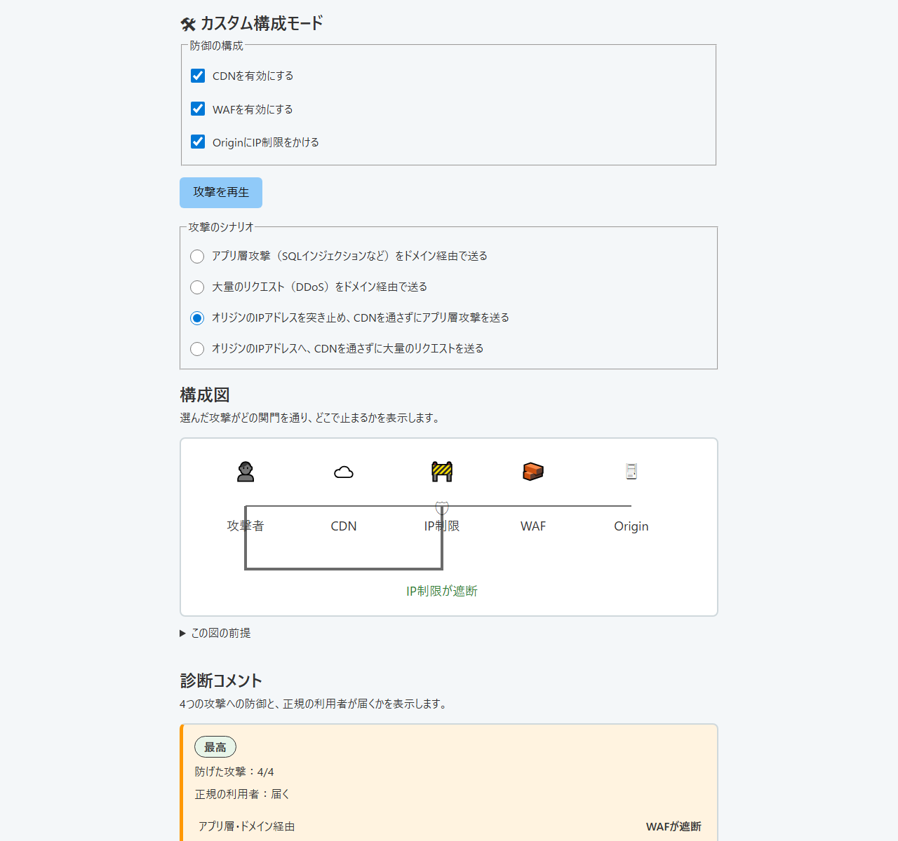
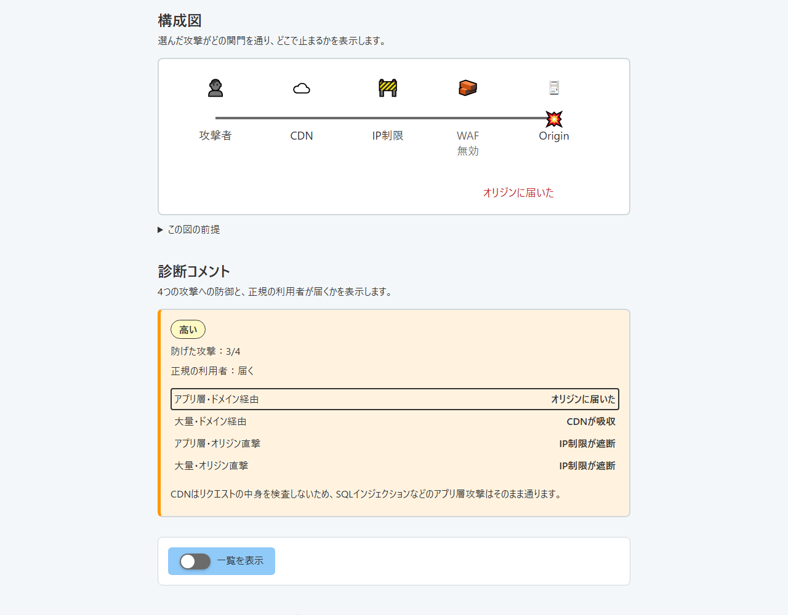
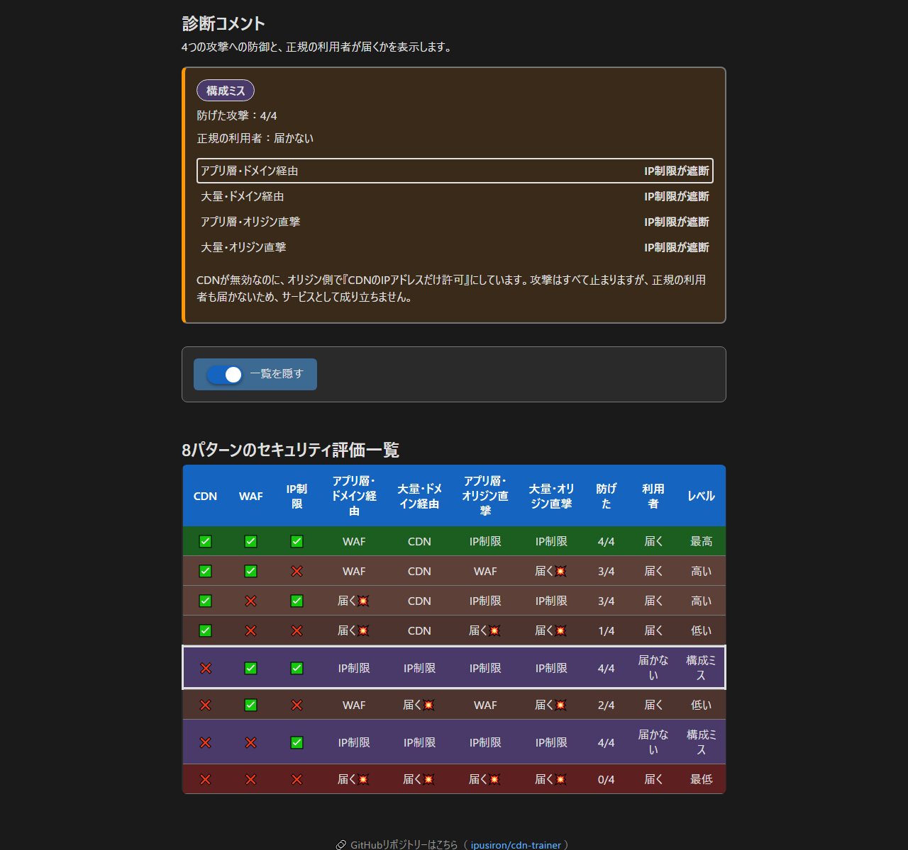

<!--
---
id: day026
slug: cdn-trainer

title: "CDN Trainer"

subtitle_ja: "セキュアなCDN構成を学べる体験型ツール"
subtitle_en: "Interactive tool for learning secure CDN configurations"

description_ja: "CDN・WAF・オリジンサーバー構成の良し悪しを、4つの攻撃シナリオと8構成で学べるセキュリティ教育用Webツール。攻撃経路と正規の利用者の到達可否を視覚化。"
description_en: "A security education web tool for learning CDN, WAF, and origin server configurations through hands-on experience. Visualizes attack flow and blocking with SVG animations."

category_ja:
  - ネットワーク
category_en:
  - Network

difficulty: 2

tags:
  - CDN
  - WAF
  - DDoS
  - IP制限
  - 多層防御
  - セキュリティ可視化

repo_url: "https://github.com/ipusiron/cdn-trainer"
demo_url: "https://ipusiron.github.io/cdn-trainer/"

hub: true
---
-->

# CDN Trainer - セキュアなCDN構成を学べる体験型ツール


[](https://ipusiron.github.io/cdn-trainer/)

**Day026 - 生成AIで作るセキュリティツール100**

**CDN Trainer**は、CDN・WAF・オリジンサーバー構成の良し悪しを、自分で構成を選びながら学べるセキュリティ教育用Webツールです。
4つの攻撃シナリオを8通りの構成で比べ、攻撃が止まる場所と正規の利用者が届くかを、構成図と診断で確認できます。

---

## 🌐 デモページ

👉 [https://ipusiron.github.io/cdn-trainer/](https://ipusiron.github.io/cdn-trainer/)

ブラウザーで直接利用できます。

---

## 📸 スクリーンショット



> *CDN・WAF・IP制限をすべて有効にした構成。CDNを迂回したアプリ層攻撃がIP制限で止まり、診断は最高・4/4。*



> *CDNとIP制限だけを有効にした構成。ドメイン経由のアプリ層攻撃がオリジンに届き、診断は高い・3/4。*



> *CDNなしでIP制限を有効にすると、正規の利用者も届かない。ダーク表示の診断と8パターン一覧で構成ミスを確認。*

---

## ✨ 機能

- CDN・WAF・IP制限の有効／無効を組み合わせる8通りの構成
- アプリ層攻撃／大量のリクエストと、ドメイン経由／オリジン直撃を組み合わせる4シナリオ
- 攻撃の経路と停止位置を表示するSVGアニメーション
- 防げた攻撃の数、正規の利用者の到達可否、5段階のレベルによる診断
- 現在の構成を強調する8パターン一覧表
- ダークモードと設定の保存、前提と使い方を確認するヘルプ
- キーボード操作、動きを減らす設定、スマートフォン表示への対応

---

## 📖 使い方

1. 「防御の構成」でCDN・WAF・IP制限を選択する。
2. 「攻撃のシナリオ」で攻撃の種類と経路を選択する。
3. 自動更新される構成図と診断コメントで、停止位置と利用者の到達可否を確認する。
4. 同じ状態を見直すときは「攻撃を再生」を押す。
5. 「一覧を表示」で8構成を比較する。狭い画面では図や表の箱を横にスクロールする。
6. ヘルプボタンで前提やレベルの基準を確認する。Escでも閉じられる。

はじめはすべて有効にし、オリジン直撃のアプリ層攻撃を選ぶと、IP制限で止まる様子を確認できます。
次にWAFだけを外し、ドメイン経由のアプリ層攻撃に切り替えると、CDNとIP制限を通過してオリジンに届きます。

---

## 🔬 判定のモデル

### 前提

- ドメイン経由は、攻撃者→CDN（有効時）→オリジン側の入口（IP制限）→WAF→Originの順である。
- オリジン直撃（CDNバイパス）は、攻撃者→オリジン側の入口（IP制限）→WAF→Originの順で、CDNを通らない。
- WAFはオリジンの手前に置く（ロードバランサーなどに付けるWAF）。
- IP制限は、オリジン側の入口でCDNのIPアドレスからの接続だけを許可する。
- CDNは大量のリクエストを吸収するが、アプリ層攻撃の中身は検査しない。WAFはアプリ層攻撃を止めるが、大量のリクエストは吸収しない。
- CDNが無効なら、ドメインはオリジンを直接指す。

### 4つのシナリオ

- アプリ層・ドメイン経由：アプリ層攻撃（SQLインジェクションなど）をドメイン経由で送る。
- 大量・ドメイン経由：大量のリクエスト（DDoS）をドメイン経由で送る。
- アプリ層・オリジン直撃：オリジンのIPアドレスを突き止め、CDNを通さずにアプリ層攻撃を送る。
- 大量・オリジン直撃：オリジンのIPアドレスへ、CDNを通さずに大量のリクエストを送る。

### レベルの基準

- 構成ミス：正規の利用者が届かない。防げた数よりも優先する。
- 最高：4つの攻撃を防ぎ、正規の利用者も届く。
- 高い：3つの攻撃を防ぎ、正規の利用者も届く。
- 低い：1つまたは2つの攻撃を防ぎ、正規の利用者も届く。
- 最低：攻撃を1つも防げない。

### 8パターン表

✅は有効、❌は無効です。攻撃の列には停止した関門を示し、止まらない場合は「届く💥」と表示します。

| CDN | WAF | IP制限 | アプリ層・ドメイン経由 | 大量・ドメイン経由 | アプリ層・オリジン直撃 | 大量・オリジン直撃 | 防げた | 利用者 | レベル |
|---|---|---|---|---|---|---|---|---|---|
| ✅ | ✅ | ✅ | WAF | CDN | IP制限 | IP制限 | 4/4 | 届く | 最高 |
| ✅ | ✅ | ❌ | WAF | CDN | WAF | 届く💥 | 3/4 | 届く | 高い |
| ✅ | ❌ | ✅ | 届く💥 | CDN | IP制限 | IP制限 | 3/4 | 届く | 高い |
| ✅ | ❌ | ❌ | 届く💥 | CDN | 届く💥 | 届く💥 | 1/4 | 届く | 低い |
| ❌ | ✅ | ✅ | IP制限 | IP制限 | IP制限 | IP制限 | 4/4 | 届かない | 構成ミス |
| ❌ | ✅ | ❌ | WAF | 届く💥 | WAF | 届く💥 | 2/4 | 届く | 低い |
| ❌ | ❌ | ✅ | IP制限 | IP制限 | IP制限 | IP制限 | 4/4 | 届かない | 構成ミス |
| ❌ | ❌ | ❌ | 届く💥 | 届く💥 | 届く💥 | 届く💥 | 0/4 | 届く | 最低 |

### 有効な項目の数で採点しない理由

同じ2項目を有効にしても、止められる攻撃は構成によって異なります。
攻撃をすべて止めても正規の利用者が届かなければサービスとして使えないため、攻撃の結果と利用者の到達可否を分けて判定します。

---

## 🎯 学習のポイント

### 多層防御とアプリケーション層防御

CDN・WAF・IP制限は、このモデルでは異なる役割を持ちます。
CDNだけではアプリ層攻撃が通るため、WAFを組み合わせる意味を確認できます。

### CDNバイパスとオリジンのIPアドレス

CDNを有効にしても、オリジンのIPアドレスが知られるとCDNを迂回できます。
IPアドレスを隠すだけでなく、オリジン側で受け付ける接続も制限する必要があります。

IPアドレスが知られる経路には、DNS-onlyのレコード、同じサーバーで運用するメール、過去のDNSレコードがあります。
公開済みのDNS情報は後からCDNを有効にしても消えません。
出典は[Cloudflareのオリジン保護ガイド](https://developers.cloudflare.com/fundamentals/security/protect-your-origin-server/)です。

### CDNなしのIP制限は構成ミス

CDNからだけ接続を許可しているのにCDNを無効にすると、正規の利用者も遮断されます。
「防げた攻撃：4/4」だけを見て安全と判断せず、利用者の経路も確認する必要があります。

---

## 🔒 実運用での主な対策

実運用では、IP制限に加えて接続元の認証や、オリジンを公開しない接続方式を検討します。

- CDNのIPアドレスだけをオリジンで許可し、それ以外を遮断する。
- 秘密のHTTPヘッダーをCDNから付け、オリジンで検証する。
- Authenticated Origin PullsでCloudflareからの接続を証明書で確認する。
- Cloudflare Tunnelを使い、オリジンの公開IPアドレスを必要としない接続にする。

これらの方式と条件は[Cloudflareのオリジン保護ガイド](https://developers.cloudflare.com/fundamentals/security/protect-your-origin-server/)に説明があります。
共通の証明書やIP範囲だけでは、自分のサービスだけから来たことの保証にならない点にも注意が必要です。

CloudFrontでは、AWS管理のプレフィックスリスト`com.amazonaws.global.cloudfront.origin-facing`を使い、オリジン向けサーバーのIP範囲をセキュリティグループで許可できます。
詳しくは[AWSのIPアドレス範囲の説明](https://docs.aws.amazon.com/AmazonCloudFront/latest/DeveloperGuide/LocationsOfEdgeServers.html)を参照してください。

CloudFrontからALBへ秘密のヘッダーを送り、ALBでその値があるリクエストだけを転送する方式もあります。
ヘッダーの名前と値は秘密に保ち、HTTPSを使います。
VPC originsでは、プライベートサブネットのALBなどを公開インターネットに出さずに接続できます。
詳しくは[AWSのALBへのアクセス制限](https://docs.aws.amazon.com/AmazonCloudFront/latest/DeveloperGuide/restrict-access-to-load-balancer.html)を参照してください。

---

## 🔒 このツールのセキュリティ

- meta CSPで同一オリジンのスクリプトとスタイルだけを許可する。インラインハンドラーとstyle属性は使わない。
- referrerを`no-referrer`に設定する。
- 表示はDOM APIと`textContent`で組み立てる。`innerHTML`は使わない。
- アプリの動作中に外部API・CDN・フォントへ通信しない。
- localStorageに保存するのはダークモード設定だけである。保存できなくても動作する。

---

## ⚠️ 注意

このモデルは学習用に単純化しています。実際のCDNにはレート制限やWAF機能もあり、製品・契約・設定によって防御できる範囲が変わります。
WAFの置き場所でも経路と結果は変わりますが、この版ではオリジンの手前に固定しています。
置き場所の選択は第2弾で扱う予定です。

IP制限だけで十分とは限りません。このツールの「最高」はモデル内の評価であり、実システムの安全性を保証するものではありません。

---

## 🧾 用語集

| 用語 | 解説 |
|------|------|
| **CDN（Content Delivery Network）** | 世界中の中継サーバーでコンテンツを配信する仕組み。このモデルでは大量のリクエストを吸収する役割。 |
| **WAF（Web Application Firewall）** | Webアプリへの攻撃（例：SQLインジェクション）を検知・防御する仕組み。 |
| **オリジンサーバー（Origin Server）** | 元のコンテンツやアプリケーションを提供するサーバー。攻撃から守る対象。 |
| **IP制限** | 特定のIPアドレスからの接続だけを許可する仕組み。このモデルではCDNのIPアドレスだけを許可。 |
| **CDNバイパス** | CDNを通さずに直接オリジンサーバーへ接続すること。 |
| **構成図** | 通信の流れや防御の位置関係を図で表したもの。 |

---

## 🔗 参考

- [Cloudflare：Protect your origin server](https://developers.cloudflare.com/fundamentals/security/protect-your-origin-server/)
- [AWS：Locations and IP address ranges of CloudFront edge servers](https://docs.aws.amazon.com/AmazonCloudFront/latest/DeveloperGuide/LocationsOfEdgeServers.html)
- [AWS：Restrict access to Application Load Balancers](https://docs.aws.amazon.com/AmazonCloudFront/latest/DeveloperGuide/restrict-access-to-load-balancer.html)

---

## 🧪 テスト

Node.js 22以上で、次のコマンドを実行します。追加の依存パッケージやインストールは不要です。
GitHub Actionsでもpushとpull_requestに対して自動実行します。

```sh
npm test
```

| テストファイル | 検証する内容 |
|---|---|
| `test/model.test.js` | 8構成×4シナリオの結果、経路、座標、不正な入力、モデルの性質 |
| `test/messages.test.js` | 辞書のキーと置換、モデルと画面処理に日本語リテラルがないこと |
| `test/html.test.js` | CSP・referrer・ARIA・シナリオ・インラインコードの不使用 |
| `test/script.test.js` | DOM API、rAFの取り消し、localStorageの例外処理 |
| `test/contrast.test.js` | ライト・ダークの全配色のコントラスト比4.5:1以上 |
| `test/format.test.js` | ソースとテストの最長行・行数によるminifyの検出 |
| `test/readme.test.js` | READMEの8パターン表の全セル、YAML構造、ツリー、画像参照 |

---

## 📁 ディレクトリー構造

```text
cdn-trainer/                 # CDN構成を学ぶ静的Webアプリ
├── .github/                 # GitHub用の設定
│   └── workflows/           # CIワークフロー
│       └── test.yml         # pushとpull_requestでNode.js 22のテストを実行
├── .gitignore               # node_modules・ログ・.claude/をGit管理から除外
├── .nojekyll                # GitHub PagesのJekyll処理を無効化するマーカー
├── CLAUDE.md                # 開発ガイド（構成・コマンド・判定モデル・テスト）
├── LICENSE                  # MITライセンス
├── README.md                # 本ファイル（使い方・判定モデル・テスト・構成）
├── package.json             # npm testの定義。依存パッケージなし
├── index.html               # 画面・構成選択・シナリオ・ヘルプ・meta CSP
├── style.css                # 配色変数・ダーク・レスポンシブ・構成図
├── cdn-messages.js          # 画面の文言の辞書（JSが出す日本語を集約）
├── cdn-model.js             # 4シナリオ×8構成の判定・経路・座標。DOM非依存
├── script.js                # 構成図の描画と再生・診断・一覧・ヘルプ・ダーク
├── assets/                  # README用の画像
│   ├── screenshot.png       # 全部有効・オリジン直撃をIP制限で遮断
│   ├── screenshot2.png      # CDNとIP制限だけ・アプリ層攻撃が到達
│   └── screenshot3.png      # ダーク・構成ミスの診断と8パターン一覧
└── test/                    # node --testによる自動テスト
    ├── model.test.js        # 判定結果・経路・座標の期待値と性質
    ├── messages.test.js     # 辞書のキーとJSの日本語リテラルの検査
    ├── html.test.js         # HTMLのCSP・referrer・ARIA・style属性なし
    ├── script.test.js       # DOM API・rAF取り消し・保存の例外処理
    ├── contrast.test.js     # ライト・ダークのコントラスト比
    ├── format.test.js       # 最長行・行数によるminify検出
    └── readme.test.js       # READMEの表・YAML・ツリー・画像参照
```

---

## 💻 動作環境

モダンブラウザー向けの静的HTML・CSS・JavaScriptです。外部ライブラリーやビルドは不要です。
ChromiumでHTTP配信と`file://`の両方の動作を確認しています。

`index.html`を直接開くか、リポジトリーのフォルダーで次のコマンドを実行して`http://localhost:8000/`を開きます。

```sh
python -m http.server 8000
```

---

## 📄 ライセンス

MIT License - 詳細は[LICENSE](LICENSE)をご覧ください。

---

## 🛠️ このツールについて

本ツールは、「生成AIで作るセキュリティツール100」プロジェクトの一環として開発されました。
このプロジェクトでは、AIの支援を活用しながら、セキュリティに関連するさまざまなツールを100日間にわたり制作・公開していく取り組みを行っています。

プロジェクトの詳細や他のツールについては、以下のページをご覧ください。

🔗 [https://akademeia.info/?page_id=42163](https://akademeia.info/?page_id=42163)
