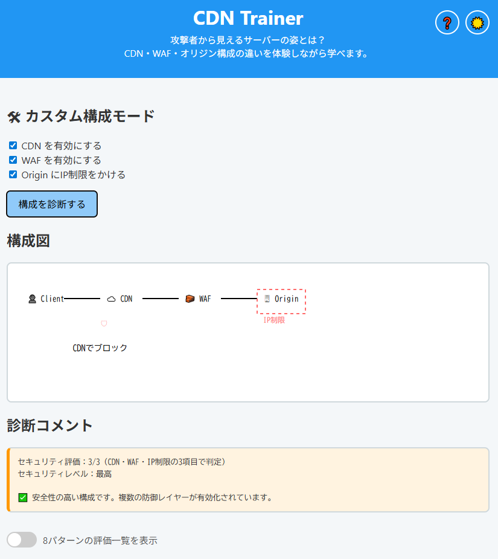

# CDN Trainer - セキュアなCDN構成を学べる体験型ツール


**Day026 - 生成AIで作るセキュリティツール100**

**CDN Trainer** は、CDN・WAF・オリジンサーバ構成の良し悪しを、構成を自分で選びながら体験的に学べる教育用Webツールです。

初学者でもチェックを入れて「診断する」だけで、守られているかどうかが視覚的に理解できます。

---

## 🔍 デモページ

👉 [https://ipusiron.github.io/cdn-trainer/](https://ipusiron.github.io/cdn-trainer/)

---

## 📸 スクリーンショット

>
>
>*ダミー*

---

## 🎯 主な機能

- ✅ CDN / WAF / IP制限の有効・無効を自分で選択できるカスタム構成モード
- ✅ 選択内容に応じた構成図をSVGで自動生成
- ✅ セキュリティ評価（3項目でのスコア）と「最高〜最低」のランクを表示
- ✅ 診断コメントでリスクと改善点をやさしく解説
- ✅ スマホでも見やすいレスポンシブ構成

---

### 💡 評価方式について

構成の良し悪しは、以下の3要素で判断されます：

- CDNの有効／無効
- WAFの有効／無効
- OriginサーバへのIP制限の有無

それぞれ1点で最大3点となり、「セキュリティ評価：n/3（CDN・WAF・IP制限の3項目で判定）」として表示されます。  
また、点数に応じて「最高」「高い」「低い」「最低」のセキュリティレベルが表示されます。

---

## 🧾 用語集

| 用語 | 解説 |
|------|------|
| **CDN（Content Delivery Network）** | Webサーバーの代わりに、世界中の中継サーバーがコンテンツを届けてくれる仕組み。攻撃を防ぐ盾としても使える。 |
| **WAF（Web Application Firewall）** | Webアプリへの不正アクセス（例：SQLインジェクション）を検知・防御する仕組み。CDNとセットで導入されることが多い。 |
| **オリジンサーバー（Origin Server）** | あなたの本来のWebサーバー。CDNの裏側にある本体。攻撃から守るべき対象。 |
| **IP制限** | 特定のIPアドレス（例：CDN経由のアクセス）のみに通信を許可することで、直接の攻撃を防ぐ技術。 |
| **CDNバイパス** | CDNを通さずに直接オリジンサーバーへアクセスされてしまう状態。構成ミスで起こりやすく危険。 |
| **構成図** | ネットワークの流れや防御の位置関係を図で表したもの。視覚的に理解しやすい。 |

---

## 📁 ファイル構成

```
cdn-trainer/
├── index.html ... メインUI
├── style.css ... スタイル定義
├── script.js ... ロジックと診断切り替え
└── README.md
```

---

## 📄 ライセンス

MIT License - 詳細は[LICENSE](LICENSE)をご覧ください。

---

## 🛠 このツールについて

本ツールは、「生成AIで作るセキュリティツール100」プロジェクトの一環として開発されました。
このプロジェクトでは、AIの支援を活用しながら、セキュリティに関連するさまざまなツールを100日間にわたり制作・公開していく取り組みを行っています。

プロジェクトの詳細や他のツールについては、以下のページをご覧ください。

🔗 [https://akademeia.info/?page_id=42163](https://akademeia.info/?page_id=42163)
